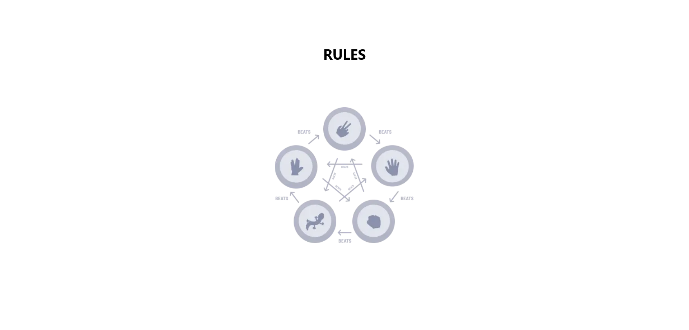

# Rock, Paper, Scissors, Lizard, Spock

This is a variance of the classic rock, paper, scissors game, talked about on the show Big Bang Theory

## Table of contents

- [Overview](#overview)
  - [The challenge](#the-challenge)
  - [Screenshots](#screenshot)
  - [Links](#links)
- [My process](#my-process)
  - [Built with](#built-with)
  - [What I learned](#what-i-learned)

## Overview

Users should be able to:

- View the optimal layout for the game depending on their device's screen size
- Play Rock, Paper, Scissors, Lizard, Spock against the computer
- Maintain the state of the score after refreshing the browser

### Screenshots




### Links

- Live Site URL: [Add live site URL here](https://your-live-site-url.com)

## My process

### Built with

- Semantic HTML5 markup
- Mobile-first workflow
- [React](https://reactjs.org/) - JS library
- [Next.js](https://nextjs.org/) - React framework
- [TailwindCSS](https://tailwindcss.com/) - For styles
- [Typescript](https://www.typescriptlang.org/) - For static typechecking in JS

### What I learned

The first thing I learned is that in React 18 if strict mode is on components unmount, and then remount again right after their
initial mount, this has been added to React in preparation for a future reusable state feature that will be added.

Because of this, any useEffects within the component will be run twice. Firstly on initial mount, again after the component is unmounted, and then remounted again. This can be an issue, but there are a few ways to solve it.

The first way is just to turn off strict mode, but this is not recommeded. Strict mode helps warn/protect about alot of potential bugs.

The second and more preferred way is to make your effects more resilient to mounting, one situation where this would be needed is when adding an event listener to a node, or utilizing web API's such as setTimeout/setInterval. To make your effects resilient to mounting in these situations you would utilize the cleanup function.

Example:

```js
useEffect(() => {
  // creates an event listener that prints hello world to the console if you click anywhere in the document
  document.addEventListener("click", () => {
    console.log("hello world");
  });
}, []);
```

The effect above would print hello world to the console twice, because two listeners end up being created. Below is a visual of what happens with the component

Component mounts -> effect runs -> creates listener
Componnet unmounts
Component mounts -> effect runs -> creates listener

In order to make the effect resilient to this, you must cleanup the listener whenever the component unmounts, like so.

```js
useEffect(() => {
  const listener = () => {
    console.log("hello world");
  };

  document.addEventListener("click", listener);

  return () => {
    document.removeEventListener("click", listener);
  };
}, []);
```

Below is the new cycle for the component, it will now only print one hello world at a time.

Component mounts -> effect runs -> creates listener
Componnet unmounts -> cleanup function runs -> listener is removed
Component mounts -> effect runs -> creates listener

To protect against remounting in any other situation that wont utilize a cleanup function, you can create a boolean variable
that starts at true, and wrap whatever youre trying to do in the effect in a conditional that utilizes this variable, and after
whatever youre trying to do, assign this variable as false, to keep things from being done again when the effect runs the second time. The only issue with this is that assignments to variables from inside useEffect are lost after each render, to resolve this issue you must utilize useRef, to protect the value across renders.

Example:

```js
let shouldLog = useRef(true);

// logs hello world only once
useEffect(() => {
  if (shouldLog.current) {
    shouldLog.current = false;
    console.log("hello world");
  }
}, []);
```

The second thing I learned is that setting state in a useEffect that runs based on another state being set can cause your component to render more than once.

Example:

```js
const [state1, setState1] = useState(0);
const [state2, setState2] = useState(0);

setState1(1);

// logs hello world only once
useEffect(() => {
  setState2(2);
}, [setState1]);

console.log("hello world");
```

The above log would print hello world twice, this is because the component is rendered twice, once when setState1 is called, and again when setState2 is called from useEffect.

In React whenever setState is called it causes the component and all its children to re render. Generally React batches multiple setState calls together into one rerender in order to prevent performance issues, but in this instance the calls to setState1 and setState2 are not batched together. This really confused me at first, then I found out that the reason for this is that useEffects callback does not run setState2 until after the component would have already rerenderd from the state change the effect is watching for in its dependency array, causing two seperate renders.
